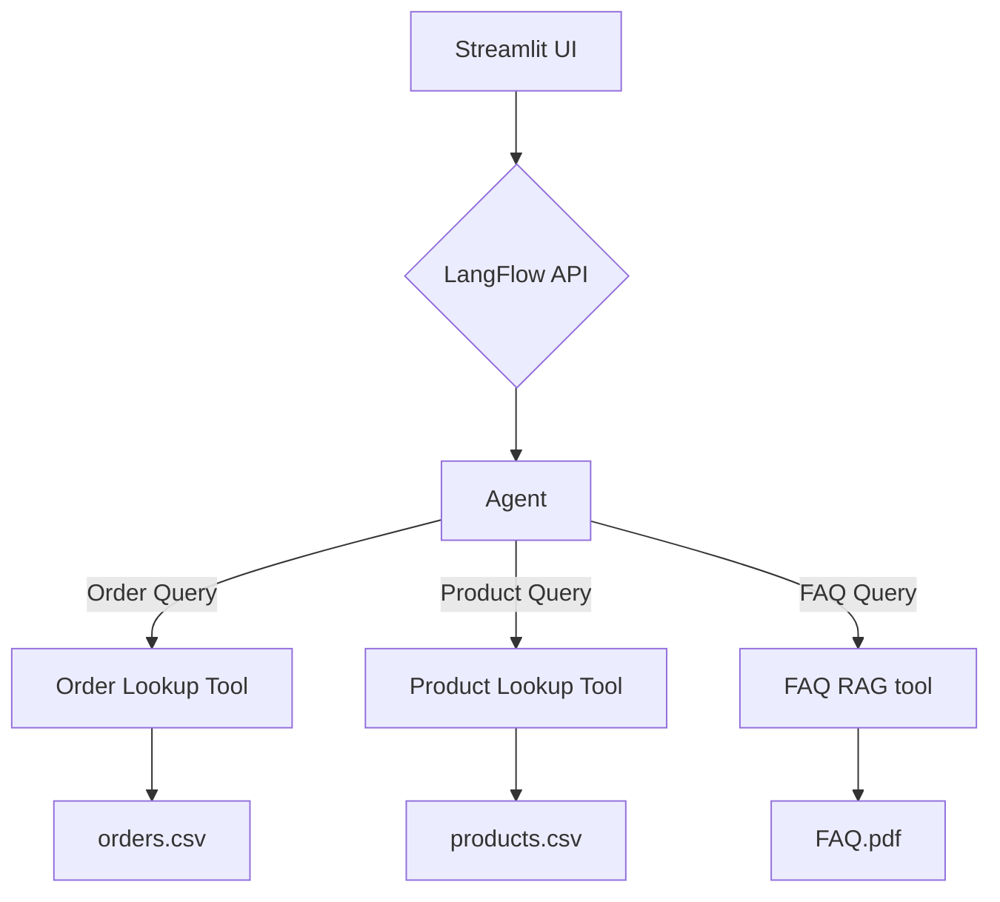

# 🛍️ Agentic RAG: A Smart Chatbot for Your Product Assistant

A smart, interactive chat assistant that helps users find information about products, track orders, and answer FAQs using Retrieval-Augmented Generation (RAG).

## 📋 Overview

This project implements a Streamlit-based chat interface that connects to a LangFlow API to provide intelligent responses about products, orders, and frequently asked questions (FAQs). The assistant uses RAG to retrieve relevant information from a knowledge base consisting of product and order data, as well as a PDF document for FAQs.

## ✨ Features

- 💬 Interactive chat interface
- 🔍 Product information lookup
- 📦 Order status tracking
- ❓ FAQ answering capabilities
- 🤖 AI-powered responses using RAG

## 🛠️ Technology Stack

- **Frontend**: Streamlit
- **Backend**: LangFlow API
- **Data**: CSV files for products and orders, PDF for FAQs
- **Authentication**: Environment variables for API tokens


## 📐 Architecture


##  Getting Started

### Prerequisites

- Python 3.12+
- LangFlow API access token

### Installation

1. Clone the repository:
   ```
   git clone https://github.com/yourusername/ai-product-assistant.git
   cd ai-product-assistant
   ```

2. Install dependencies:
   ```
   pip install -r requirements.txt
   ```

3. Create a `.env` file with your API token:
   ```
   AUTH_TOKEN=your_langflow_api_token
   ```

### Running the Application

Start the Streamlit app:
```
streamlit run streamlit_ui.py
```

## 📊 Data Sources

The assistant uses two main data sources:
- `products.csv`: Contains product information (ID, name, description)
- `orders.csv`: Contains order information (order number, customer details, status)
- `FAQ.pdf`: Contains answers to frequently asked questions.

## 🔄 API Integration

The application connects to a LangFlow API endpoint to process user queries and generate responses. The API call is configured in the `run_flow` function in `streamlit_ui.py`.

## 🧪 Testing

You can test the API connection using the `api_test.py` script:
```
python api_test.py
```

## 📝 Usage Examples

- "Tell me about product 201"
- "What's the status of order 1002?"

## 🔒 Security

API tokens are stored in environment variables and not hardcoded in the application.

## 🤝 Contributing

Contributions are welcome! Please feel free to submit a Pull Request.

## 📄 License

This project is licensed under the MIT License - see the LICENSE file for details.
